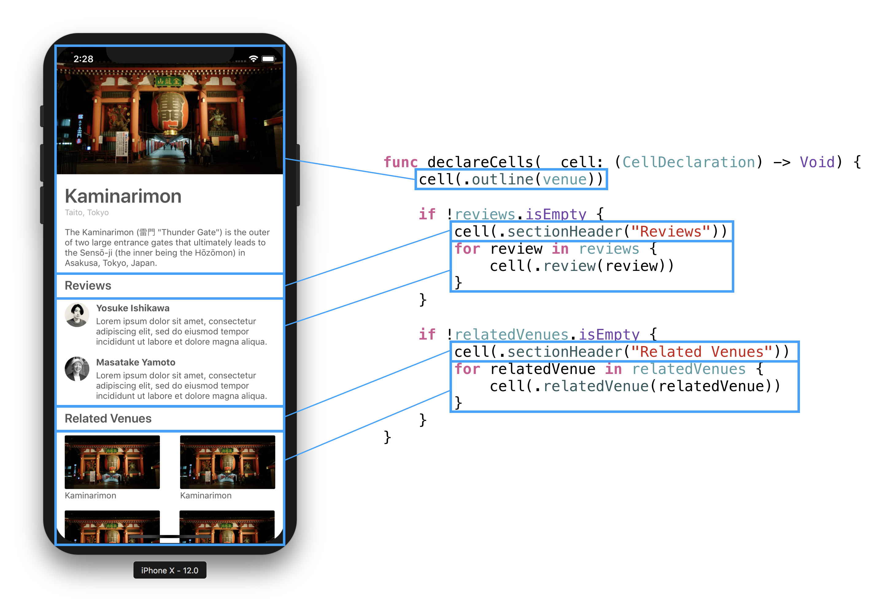

# DataSourceKit

Declarative, testable data source of UICollectionView and UITableView.



## Installation

There are 2 ways to install DataSourceKit to your project.

### CocoaPods

Add a line `pod "DataSourceKit"` to your Podfile and run `pod install`.

### Carthage

Add a line `github "ishkawa/DataSourceKit"` to your Cartfile and run `carthage update`.

## Simple usage

1. Let cells to conform BindableCell.
2. Let view controllers to conform CellsDeclarator.
3. Create an instance of CollectionViewDataSource and assign it to dataSource of UICollectionView.

### Let cells to conform BindableCell

To make cells available in DataSourceKit machanism, let cells to conform BindableCell. BindableCell is a protocol which provide interfaces for registering cell to UICollectionView and binding cell with value.

For example, following implementation indicates that ReviewCell will be registered by UINib named "ReviewCell" and reuse identifier "Review", and the cell will be binded with value Review.

```swift
extension ReviewCell: BindableCell {
    static func makeBinder(value review: Review) -> CellBinder {
        return CellBinder(
            cellType: ReviewCell.self,
            nib: UINib(nibName: "ReviewCell", bundle: nil),
            reuseIdentifier: "Review",
            configureCell: { cell in
                cell.authorImageView.image = review.authorImage
                cell.authorNameLabel.text = review.authorName
                cell.bodyLabel.text = review.body
            })
    }
}
```

### Let view controllers to conform CellsDeclarator

Next step is to declare arrangement of cells. CellsDeclarator is a protocol to do this.

Suppose we have following data in a view controller:

```swift
final class VenueDetailViewController: UIViewController {
    var venue: Venue
    var reviews: [Review]
    var relatedVenues: [Venue]
}
```

To declare arrangement of cells, pass `makeBinder(value:)` of cells to `cell(_:)` in `declareCells(_:)`. Since call of `cell(_:)` will be converted to actual cell, call `cell(_:)` in the same order as you want to display cells.

Following example is the declaration of the demo which is displayed on the top of this page.

```swift
extension VenueDetailViewController: CellsDeclarator {
    typealias CellDeclaration = CellBinder

    func declareCells(_ cell: (CellDeclaration) -> Void) {
        cell(VenueOutlineCell.makeBinder(value: venue))

        if !reviews.isEmpty {
            cell(SectionHeaderCell.makeBinder(value: "Reviews"))
            for review in reviews {
                cell(ReviewCell.makeBinder(value: review))
            }
        }

        if !relatedVenues.isEmpty {
            cell(SectionHeaderCell.makeBinder(value: "Related Venues"))
            for relatedVenue in relatedVenues {
                cell(RelatedVenueCell.makeBinder(value: relatedVenue))
            }
        }
    }
}
```

In above code, it is assumed that VenueOutlineCell, SectionHeaderCell, ReviewCell and RelatedVenueCell conform to BindableCell protocol.

### Assign CollectionViewDataSource to dataSource of UICollectionView

Final step is creating instance of CollectionViewDataSource and assigning cell declarations to it.

```swift
final class VenueDetailViewController: UIViewController {
    ...

    @IBOutlet private weak var collectionView: UICollectionView!

    private let dataSource = CollectionViewDataSource()

    override func viewDidLoad() {
        super.viewDidLoad()

        let layout = collectionView.collectionViewLayout as! UICollectionViewFlowLayout
        layout.estimatedItemSize = UICollectionViewFlowLayout.automaticSize
        collectionView.dataSource = dataSource

        dataSource.cellDeclarations = cellDeclarations
    }
}
```

cellDeclarations of view controller is computed from result of `declareCells(_:)` of the view controller. When cellDeclarations of dataSource is updated, dataSource is ready for returning new arrangement. Then, you can invoke update of UICollectionView by any of `reloadData()`, `reloadItems(at:)`, `insertItems(at:)` and `deleteItems(at:)`.

## Advanced usage

With some architectures such as MVVM and VIPER, it is important to separate logic from view. DataSourceKit has option to introduce the separation.

### Expressing cell declarations by enum

CellsDeclarator have a type parameter named CellDeclaration, which represents type of element of cells arrangement. We can specify any type for this type parameter, even if it is an plain data which declared as struct or enum.

For example, following implementation declares cells by enum.

```swift
struct VenueDetailViewState {
    var venue: Venue
    var reviews: [Review]
    var relatedVenues: [Venue]
}

extension VenueDetailViewState: CellsDeclarator {
    enum CellDeclaration: Equatable {
        case outline(Venue)
        case sectionHeader(String)
        case review(Review)
        case relatedVenue(Venue)
    }

    func declareCells(_ cell: (CellDeclaration) -> Void) {
        cell(.outline(venue))

        if !reviews.isEmpty {
            cell(.sectionHeader("Reviews"))
            for review in reviews {
                cell(.review(review))
            }
        }

        if !relatedVenues.isEmpty {
            cell(.sectionHeader("Related Venues"))
            for relatedVenue in relatedVenues {
                cell(.relatedVenue(relatedVenue))
            }
        }
    }
}
```

Since VenueDetailViewState.CellDeclaration is just a plain data, it is easy to write test like below:

```swift
class VenueDetailViewStateTests: XCTestCase {
    func testEmptyRelatedVenues() {
        let venue = Venue(photo: nil, name: "Kaminarimon")
        let review1 = Review(authorImage: nil, authorName: "Yosuke Ishikawa", body: "Foo")
        let review2 = Review(authorImage: nil, authorName: "Masatake Yamoto", body: "Bar")

        let data = VenueDetailViewState(
            venue: venue,
            reviews: [
                review1,
                review2,
            ],
            relatedVenues: [])

        XCTAssertEqual(data.cellDeclarations, [
            .outline(venue),
            .sectionHeader("Reviews"),
            .review(review1),
            .review(review2),
        ])
    }
}
```

### Associating enum declarations with cells

CollectionViewDataSource has a type parameter named CellDeclaration too. If this parameter differs from CellBinder, initializer of CollectionViewDataSource takes a function (CellDeclaration) -> CellBinder, because CollectionViewDataSource finally needs CellBinder to assemble actual cells.

```swift
final class VenueDetailViewController: UIViewController {
    @IBOutlet private weak var collectionView: UICollectionView!

    private let dataSource = CollectionViewDataSource<VenueDetailViewState.CellDeclaration> { cellDeclaration in
        switch cellDeclaration {
        case .outline(let venue):
            return VenueOutlineCell.makeBinder(value: venue)
        case .sectionHeader(let title):
            return SectionHeaderCell.makeBinder(value: title)
        case .review(let review):
            return ReviewCell.makeBinder(value: review)
        case .relatedVenue(let venue):
            return RelatedVenueCell.makeBinder(value: venue)
        }
    }

    private var state = VenueDetailViewState() {
        didSet {
            collectionView.reloadData()
        }
    }

    override func viewDidLoad() {
        super.viewDidLoad()

        let layout = collectionView.collectionViewLayout as! UICollectionViewFlowLayout
        layout.estimatedItemSize = UICollectionViewFlowLayout.automaticSize
        collectionView.dataSource = dataSource

        dataSource.cellDeclarations = state.cellDeclarations
    }
}
```
